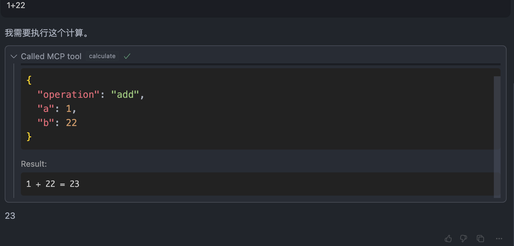
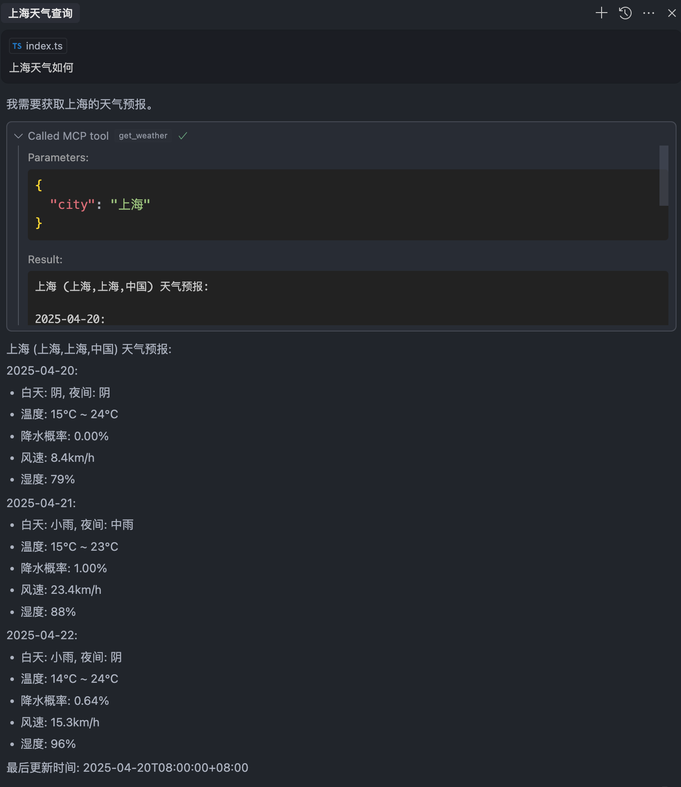
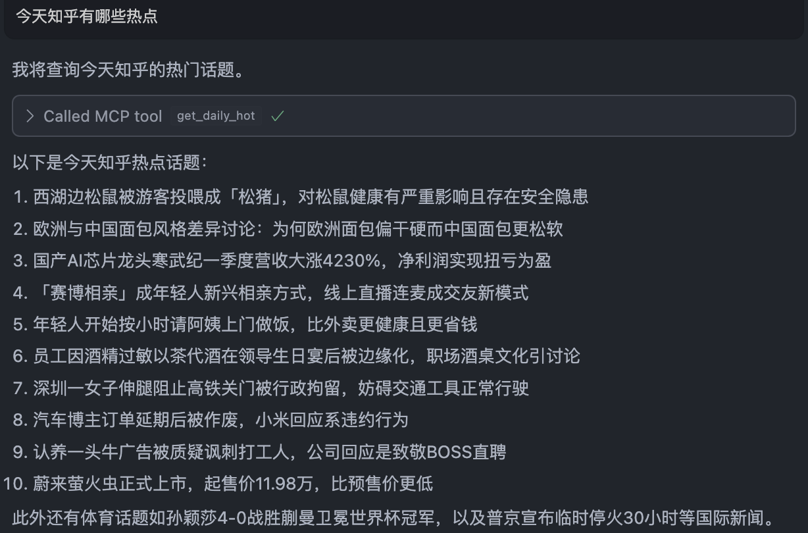

# MCP 服务

这是一个用 TypeScript 实现的模型上下文协议（MCP）服务。该服务提供了可供大语言模型（LLM）客户端使用的工具和资源。

## 概述

模型上下文协议（Model Context Protocol）是一种为大语言模型提供上下文的标准化方式。本服务器实现了 MCP 协议，提供了可供 Claude for Desktop 、Cursor 等 MCP 兼容客户端使用的工具和资源。

## 快速开始

### 前置要求

- Node.js（v16 或更高版本）
- npm 或 yarn

### 安装

1. 克隆此仓库
2. 安装依赖：

```bash
npm install
```

### 构建和运行

构建 TypeScript 代码：

```bash
npm run build
```

运行 MCP 服务器：

```bash
npm start
```

用于开发的自动重构建：

```bash
npm run dev
```

## mcp 服务列表

### weather
天气mcp服务，使用心知天气的api 服务，你需要注册心知天气的api，并申请 API KEY。

官方地址：https://www.seniverse.com/

### daily-hot
一些网站的今日热点

### 今日热点
需在本地启动今日热点服务，项目地址：
https://github.com/HelTi/DailyHotApi

## cursor 本地开发配置
启动前需运行 npm run build 生成服务文件。
### mcp 配置文件
编辑 mcp.json 文件配置，args 的文件路径根据自己的文件配置进行调整
```json
{
  "mcpServers": {
    "greeting": {
      "command": "node",
      "args": ["/mcp-services/packages/greeting/dist/index.js"]
    },
    "weather": {
      "command": "node",
      "args": ["/mcp-services/packages/weather/dist/index.js"],
      "env": {
        "SENIVERSE_API_KEY": "心知天气 API key"
      }
    },
    "daily-hot": {
      "command": "node",
      "args": ["/mcp-services/packages/daily-hot/dist/index.js"]
    }
  }
}
```

## 效果预览




